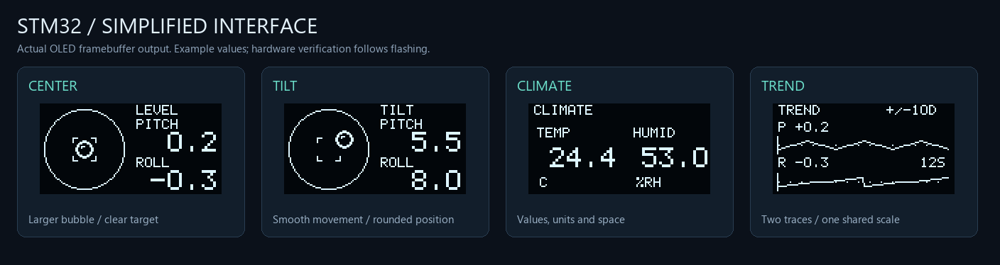

# STM32 小仪表

基于 STM32F103C8T6 的桌面小仪表：电子气泡水平仪、温湿度、Flash 历史记录和实时调试。
使用 Keil AC5 与 ST 标准外设库 V3.5.0，OLED 为单色 128×64 I2C 屏。

**推荐使用 [新版多功能仪表](level_dashboard_2026-10-09/)**。原版项目独立保留，便于参考和对比。

| 项目 | 内容 | 验收状态 |
|---|---|---|
| [新版多功能仪表](level_dashboard_2026-10-09/) | 七页仪表、温湿度、历史记录、PWM 灯光与调试 | DHT11 已实测恢复；本轮软件验证通过，新增行为待烧板验收 |
| [原版水平仪](level/) | MPU6050 电子气泡水平仪 | 原七阶段功能已完成硬件实测 |



## 新版有哪些功能

- **七页界面**：LEVEL、CLIMATE、HISTORY、SYSTEM、RAW DATA、TREND、DEBUG。气泡缓动、数字防抖，大号数值的小数点固定位置。
- **温湿度与记录**：DHT11 每 2.5 秒读取；W25Q20–128 循环保存，只使用末尾 64KB，支持掉电后恢复和最近 32 条浏览。
- **偏移灯光**：三色 LED 使用 2kHz、3600 级硬件 PWM；首页越偏离中心，红灯越亮，配合平滑换色和呼吸效果。
- **无按钮操作**：旋转翻页，历史页停留 0.8 秒自动进入浏览；记录两端继续旋转即可离开。PB10 可另接独立按钮。
- **静置渐暗**：45 秒后渐暗而不关屏，旋转、按键或累计倾斜至少 0.3° 恢复亮度。
- **原始数据与趋势**：六轴寄存器原值、约 12 秒俯仰／横滚趋势，以及 DHT 帧、PWM 和采样速率诊断。

本轮加强了倒置和超出姿态范围的保护，避免虚假水平提示；OLED 运行掉线后按 500ms 间隔检查 ACK 并重配置，恢复后补刷整屏。
已修复 DHT 下降沿中断初始化问题，用户确认温湿度正常。Flash 使用 CRC 和独立提交标记，未知记录区内容显示 LOCKED，不自动格式化。

## 快速开始

1. 下载 [新版 HEX](level_dashboard_2026-10-09/firmware/level.hex)，通过现有 ST-Link 工具烧录；需要比较时可用 [上一版 HEX](level_dashboard_2026-10-09/firmware/level_previous.hex)。
2. 按 [一步一步接线教程](level_dashboard_2026-10-09/docs/wiring-beginner.md) 接线，再阅读 [页面操作与板上验收](level_dashboard_2026-10-09/docs/dashboard.md)。
3. 放平、放稳后上电等待校准，再旋转编码器查看各页。

修改源码时，用 Keil 打开 [level.uvprojx](level_dashboard_2026-10-09/MDK-ARM/level.uvprojx)，或在仓库根目录的 PowerShell 执行：

```powershell
Set-Location .\level_dashboard_2026-10-09
.\build.cmd
```

`build.cmd` 自动查找 Keil UV4；源码为 GBK，Markdown 为 UTF-8。完整工程、库和文档都在新版目录内。

| 本轮构建结果 | 数值 |
|---|---:|
| ROM | 22,288 字节 |
| RAM（RW + ZI） | 4,288 字节 |
| Keil 编译诊断 | 0 错误、0 警告 |

软件构建和逻辑检查不代替实物验收；原版水平仪的实测结论也不等于新版全部功能已通过。
详细改动见 [更新说明](level_dashboard_2026-10-09/CHANGELOG.md)，检查范围及硬件验收见 [验证记录](level_dashboard_2026-10-09/docs/validation.md)。
