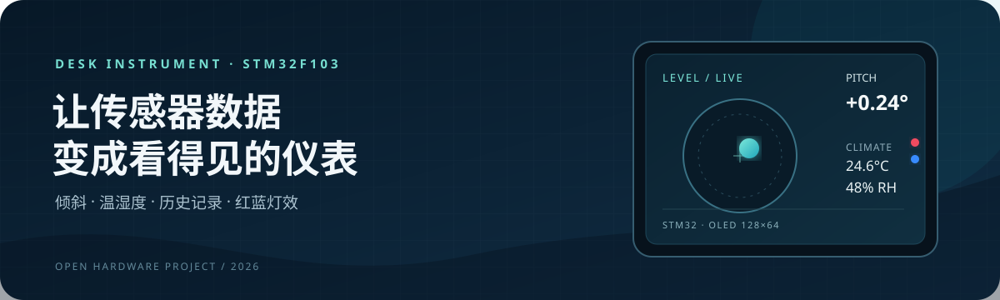
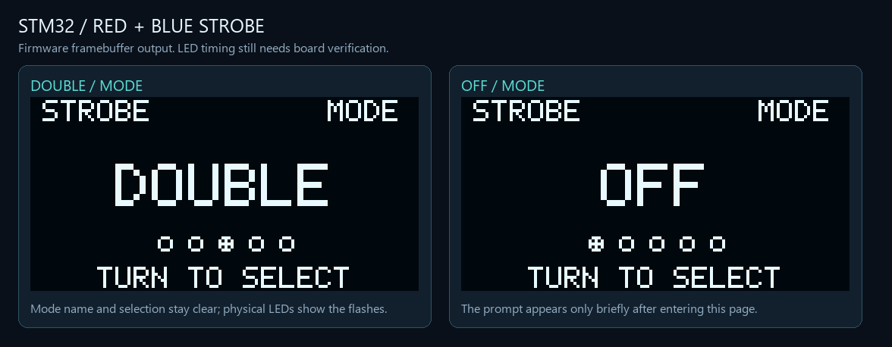

<div align="center">



<h1>STM32 多功能小仪表</h1>

**把一块 STM32F103C8T6，做成能倾斜、能测温、能记录的桌面仪表。**

[快速开始](#快速开始) · [功能一览](#功能一览) · [新版工程](level_dashboard_2026-10-09/README.md) · [接线教程](level_dashboard_2026-10-09/docs/wiring-beginner.md)


</div>

## 项目

这是一个以电子水平仪为核心的 STM32 学习项目。新版加入温湿度读取、Flash 历史记录、红蓝灯效和开机时长记录；界面通过 128×64 I²C OLED 与旋转编码器操作。

<div align="center">



红蓝灯效独立页面 · 模式可由旋转编码器切换

</div>

## 功能一览

| 页面 | 用途 |
|---|---|
| LEVEL / CLIMATE | 平滑气泡与倾斜数据 / DHT11 温湿度 |
| HISTORY / SYSTEM | 浏览测量记录 / 设备与 Flash 状态 |
| RAW DATA / TREND / DEBUG | 原始传感器值 / 约 12 秒变化曲线 / 运行诊断 |
| STROBE | 独立红蓝灯效页面，可旋转选择节奏 |
| RUNTIME / SESSIONS | 本次开机时长 / 浏览历史会话 |

旋转编码器翻页和选择。扩展模块的引脚、供电、电阻摆放和逐步验收都整理在[新手接线教程](level_dashboard_2026-10-09/docs/wiring-beginner.md)。

## 快速开始

1. 从[固件目录](level_dashboard_2026-10-09/firmware/)下载 `level.hex`，用 ST-Link 烧录。
2. 按[接线教程](level_dashboard_2026-10-09/docs/wiring-beginner.md)连接模块；逐页操作见[页面说明](level_dashboard_2026-10-09/docs/dashboard.md)。
3. 放平设备并上电，等待启动自检和水平校准完成。

需要修改源码时，用 Keil 打开新版 `MDK-ARM/level.uvprojx`，或在 Windows PowerShell 运行：

```powershell
Set-Location .\level_dashboard_2026-10-09
.\build.cmd
```

工程使用 Keil ARM Compiler 5.06 update 7 和 ST 标准外设库 V3.5.0。源码按原工程保存为 GBK，构建脚本为 CRLF。

## 发布状态

| 项目 | 当前版本 |
|---|---|
| 固件 | 2026-10-10 E · [下载 HEX](level_dashboard_2026-10-09/firmware/level.hex) |
| 编译 | 0 错误、0 警告 · ROM 31,536 B · RAM（RW + ZI）8,048 B |
| 实机状态 | 原七阶段水平仪及 DHT 修复有实测记录；E 版新增会话记录待上板验收 |
| 回退 | [上一公开版 HEX](level_dashboard_2026-10-09/firmware/level_previous.hex) · [SHA-256](level_dashboard_2026-10-09/firmware/SHA256SUMS.txt) |

突然断电时，设备无法再写入最终关机时刻；历史会话显示最近一次每分钟 Flash 检查点，因此是运行时长下界。会话功能无需 RTC、电池或日期校准。完整限制与验收方法见[验证记录](level_dashboard_2026-10-09/docs/validation.md)。

## 仓库结构

```text
level/                       原七阶段水平仪参考工程
level_dashboard_2026-10-09/  新版完整工程、固件与文档
```

PC 仿真框架和本地参考资料不在发布内容中。开始扩展前，建议先看新版[工程说明](level_dashboard_2026-10-09/README.md)和[接线教程](level_dashboard_2026-10-09/docs/wiring-beginner.md)。