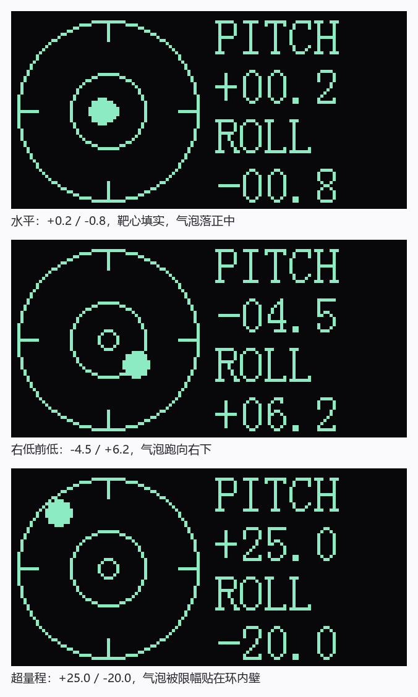
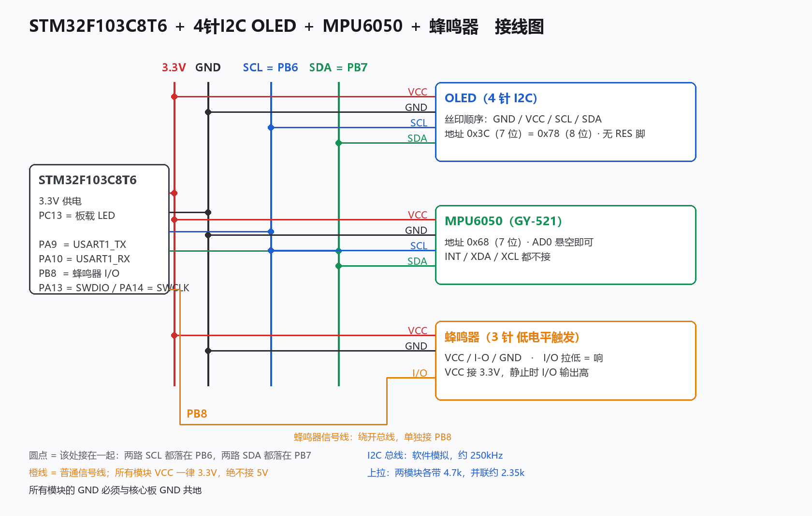
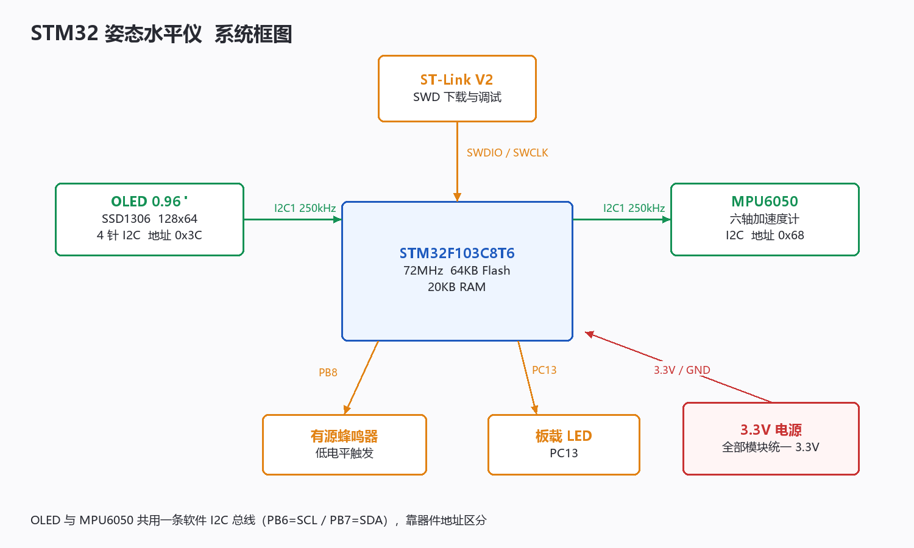
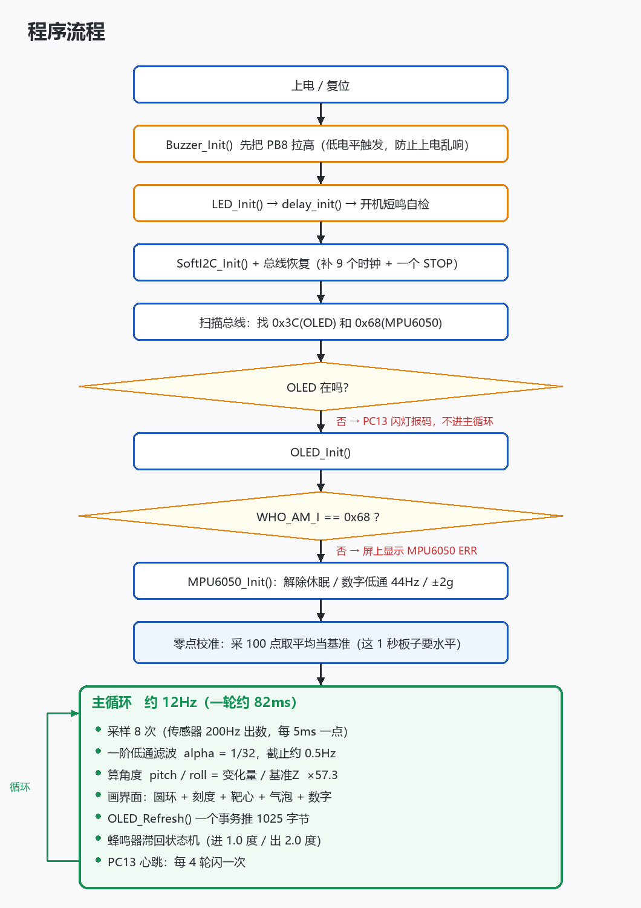

# STM32 姿态水平仪（电子气泡）

用 MPU6050 读三轴加速度算出俯仰角 / 横滚角，在 0.96 寸 OLED 上画一个气泡；
摆平时气泡落进靶心、靶心填实、蜂鸣器短鸣一声。

基于 STM32F103C8T6 最小系统板 + 标准外设库 V3.5.0，纯寄存器 / 标准库写法，
不依赖 HAL、不依赖任何第三方库，也没有用浮点运算。



## 功能

- 开机零点校准：采 100 点取平均当基准，之后所有角度都是相对基准算的
- 一阶低通滤波，时间常数约 0.3 秒，读数稳定不跳
- 气泡界面：圆环 + 四向刻度 + 靶心 + 气泡，带径向限幅
- 蜂鸣器水平提示：进阈值 1.0 度 / 出阈值 2.0 度，带滞回，只响一声
- 约 12Hz 刷新率
- 屏幕坏了也能用：PC13 闪灯报码报告总线扫描结果

## 硬件

| 器件 | 说明 |
|---|---|
| MCU | STM32F103C8T6 最小系统板（72MHz / 64KB Flash / 20KB RAM / 8MHz 晶振） |
| 显示 | 0.96 寸 OLED，SSD1306，**4 针 I2C 版**（丝印 GND VCC SCL SDA） |
| 姿态 | MPU6050（GY-521 模块，I2C，地址 0x68） |
| 提示 | 有源蜂鸣器，3 针（VCC / I-O / GND），**低电平触发** |
| 下载 | ST-Link V2（SWD） |

## 接线



| 核心板 | 接到 | 说明 |
|---|---|---|
| 3.3V | OLED VCC、MPU6050 VCC、蜂鸣器 VCC | **全部 3.3V，绝不能接 5V** |
| GND | 三个模块 GND + ST-Link GND | 必须共地 |
| PB6 | OLED SCL **+** MPU6050 SCL | 两路并在一起 |
| PB7 | OLED SDA **+** MPU6050 SDA | 两路并在一起 |
| PB8 | 蜂鸣器 I-O | 拉低 = 响 |
| PA13 / PA14 | ST-Link SWDIO / SWCLK | 下载与调试 |
| PC13 | 板载 LED，不用接线 | 低电平点亮 |

MPU6050 的 `AD0` 悬空即可（模块上已有 4.7k 下拉），`INT / XDA / XCL` 都不接。

OLED 与 MPU6050 **共用一条软件 I2C 总线**，靠器件地址区分
（OLED 0x3C / MPU6050 0x68）。两个模块各带 4.7k 上拉，并联后约 2.35k。

> ⚠️ OLED 的丝印顺序和中景园官方《4 针 B 版结构图》上印的（`VCC GND SCL SDA`）
> 是相反的，一定要按你手上模块的丝印接。**VCC 和 GND 接反会烧模块。**

## 系统框图



## 程序流程



## 怎么用

1. 接好线，确认无误后上电或按复位。
2. 头 1 秒钟屏幕显示 `CALIBRATING / KEEP IT LEVEL`，
   **这段时间板子必须保持水平**——零点就是在这一刻定的。
   同时会短鸣一声，那是蜂鸣器自检。
3. 之后进入气泡界面。把板子从倾斜慢慢摆平，气泡落进靶心时会短鸣一声。

## 编译与下载

工程文件是 `MDK-ARM/level.uvprojx`（Keil 5 格式）。

- Keil 里打开，`F7` 编译、`F8` 下载
- 或者直接烧 `MDK-ARM/Obj/level.hex`（用 ST-Link Utility / STM32CubeProgrammer）
- 命令行编译：双击 `build.cmd`

编译环境：ARM Compiler 5.06 update 7（AC5），标准外设库 V3.5.0。
仓库里带了预编译好的 `MDK-ARM/Obj/level.hex`，克隆下来可以直接烧，不用先装 Keil。

## 几个刻意的设计决定

1. **器件宏写在工程里**（Options for Target → C/C++ → Define：
   `STM32F10X_MD,USE_STDPERIPH_DRIVER`），`stm32f10x.h` 保持原版不动。

2. **角度用"相对开机基准的变化量 / 基准 Z"算**，而不是用绝对公式。
   分子分母是同一把尺子，所以零偏和标度误差一起被消掉。
   实测手头这块模块把 1g 读成约 18400（标准 16384），偏高 12.4%，
   超出正品 ±3% 公差，多半是克隆芯片——用绝对公式会整体偏 12%，
   用相对算法则完全不受影响。

3. **采样节拍和刷屏解耦**。固定每 5ms 采一个点，采满 8 个才刷一次屏。
   如果把滤波放在刷屏循环里，刷新快慢一变滤波截止频率就跟着漂，
   那就不是一个确定的滤波器了。

4. **整屏刷新是一个 I2C 事务连发 1025 字节**，不是一页一个事务，
   所以画面不会闪。（早期版本一帧要 1024 次独立事务，做不了动态画面。）

5. **气泡做径向限幅**（整数开平方），超量程时沿原方向压回环内。

6. **不碰 DMP**。气泡水平仪是静态应用，加速度直接算倾角就够了；
   DMP 要往芯片灌固件、要拉进一大堆库代码，得不偿失。

7. **`ACCEL_CONFIG` 写 0x00 而不是 0x01**。很多厂商例程给的 0x01 会打开
   加速度高通滤波，把重力分量滤掉，算倾角直接废掉。

8. **全程整数运算**，角度用"实际的 10 倍"当整型传，
   不把浮点库拉进工程。

## 想改参数

都在 `USER/main.c` 顶部：

| 宏 | 作用 |
|---|---|
| `PITCH_DIR` / `ROLL_DIR` | 数字的正负，改 `-1` 翻转 |
| `BUBBLE_X_DIR` / `BUBBLE_Y_DIR` | 气泡往哪边跑 |
| `HUD_FS_X10` | 满量程，150 表示 15.0 度跑到环内壁 |
| `LPF_SHIFT` | 滤波强度，4 = α 1/16，5 = α 1/32 |
| `SAMPLE_PER_DISPLAY` | 每次刷屏前采几个点，调小刷新更快 |
| `LEVEL_ENTER_X10` / `LEVEL_EXIT_X10` | 蜂鸣器的进 / 出阈值（滞回） |
| `BEEP_MS` / `BOOT_BEEP_MS` | 鸣叫时长 / 开机自检短鸣（设 0 关闭） |

总线速度在 `USER/i2c.h` 的 `I2C_DELAY_LOOPS`：8 约 250kHz，20 约 110kHz。
换长杜邦线后若出现花屏或读数据出错，把它调大。

## 排查

| 现象 | 先查什么 |
|---|---|
| 完全不亮 | 看 PC13 闪灯报码：慢心跳 = 两个器件都在；快闪 2 下 = 只有 OLED；快闪 3 下 = 只有 MPU6050；快闪 5 下 = 都没找到（先查共地） |
| 屏显 `MPU6050 ERR` | WHO_AM_I 没读对，右边会显示读到的实际值，正常是 104（0x68） |
| 屏显 `READ ERR` | 探测到了但读数据失败，多半是接触不良 |
| 一上电就"嘀"个不停 | 这个蜂鸣器模块 I/O 悬空时是低电平，在 I-O 和 3.3V 之间加 10k 上拉 |
| 水平时气泡不落靶心 | 校准时板子没放平，按复位重新来 |
| 读数慢半拍 | `LPF_SHIFT` 调小，或 `SAMPLE_PER_DISPLAY` 调大 |
| 画面很暗 | `oled.c` 里 `0x81` 后面那个对比度值调大 |
| 花屏、随机噪点 | 查共地和杜邦线接触；把 `I2C_DELAY_LOOPS` 调大 |

## 文件结构

```
level/
├── USER/
│   ├── main.c              主程序：校准 + 解算 + 界面 + 蜂鸣器状态机
│   ├── oled.c / oled.h     SSD1306 I2C 驱动（显存 + 整屏刷新 + 图形基元）
│   ├── oledfont.h          8x16 ASCII 字库（95 个字符）
│   ├── mpu6050.c / .h      MPU6050 驱动（直接读寄存器）
│   ├── i2c.c / i2c.h       软件 I2C（开漏，带总线恢复和流式写）
│   ├── buzzer.c / .h       PB8 蜂鸣器
│   ├── delay.c / .h        SysTick 延时
│   ├── led.c / .h          PC13 板载 LED
│   └── stm32f10x_conf.h    标准库模块开关
├── Libraries/              STM32F10x 标准外设库 V3.5.0
├── MDK-ARM/                Keil 工程（level.uvprojx）
├── docs/                   文档配图
├── readme.txt              项目说明（纯文本版，含更多细节）
└── build.cmd               命令行一键编译
```

## 说明

- **源码编码是 GBK / ANSI**，因为 Keil 默认就是 ANSI（`global.prop` 里
  `code.page=0`）。用 UTF-8 编辑器打开中文注释会乱码，但**不影响编译**。
  如果想发布到 GitHub 让注释正常显示，需要把 `USER/` 下的源文件整体转成
  UTF-8，并把 Keil 的编码设置改成 UTF-8。
- `Libraries/` 下的文件是 ST 官方标准外设库，未做任何修改。
- `USER/oledfont.h` 的 8x16 字库来自中景园 / 江协科技的教学例程，
  版权归原作者；本工程仅作学习用途。

## 实测结果

七个阶段全部在实物上一次通过：

| 阶段 | 验收 |
|---|---|
| 1 工程骨架 | PC13 心跳正常 |
| 2 软件 I2C 总线扫描 | 扫到 0x3C 和 0x68 |
| 3 OLED 点屏 | 边框、圆、三行字全对 |
| 4 MPU6050 原始数据 | 温度 26°C，数值随倾斜变化 |
| 5 零点校准 + 姿态解算 | 水平稳定，倾斜跟随 |
| 6 气泡界面 | 方向经上机确认准确 |
| 7 蜂鸣器 | 摆平短鸣，滞回正常 |

占用：Flash 5084 字节 / 64KB，RAM 约 2.1KB / 20KB。
